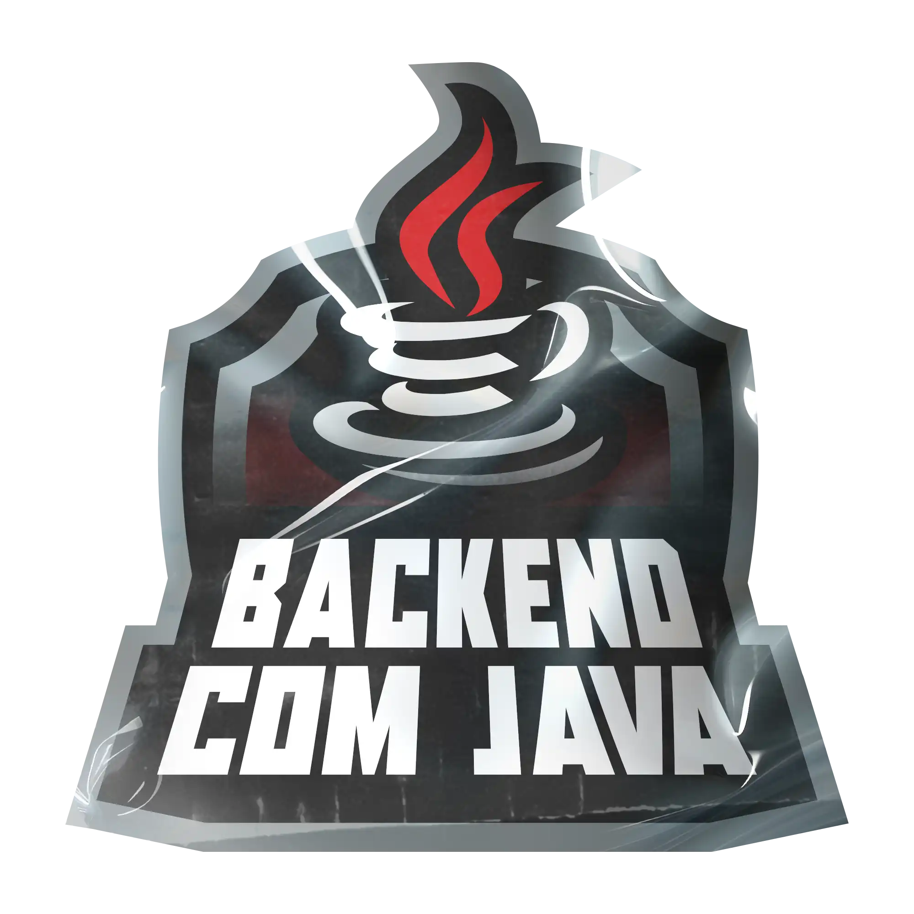

# **Bootcamp - Back-end com Java**

Este repositório os projetos desenvolvidos durante o **Santander Bootcamp 2024, trilha Back-end Java**.
Aqui você encontrará desde os fundamentos da linguagem Java até a criação de APIs robustas com Spring Framework.

## Objetivo

Desenvolver as habilidades essenciais para construir aplicações back-end escaláveis, seguras e eficientes, utilizando as melhores práticas do mercado.

## Conteúdo Programático

* **Princípios de Desenvolvimento de Software Colaborativo:** Colaboração, Git, metodologias ágeis.
* **Dominando a Linguagem de Programação Java:** Sintaxe, estruturas de dados, algoritmos.
* **Programação Orientada a Objetos com Java:** Classes, objetos, herança, polimorfismo.
* **Testes e Gerenciamento de Dependências em Projetos Java:** JUnit, Maven, Gradle.
* **Banco de Dados SQL e NoSQL Para Desenvolvedores Back-end:** Modelagem, consultas, PostgreSQL, MongoDB.
* **Ganhando Produtividade com Spring Framework e Java:** Spring Boot, REST APIs, injeção de dependências.
* **Soft Skills na Era Ágil:** Conectando Pessoas e Oportunidades: Comunicação, trabalho em equipe, networking.

## **Projetos**

### [LAB-01: Simulador de Conta Bancária em Java Através Do Terminal/Console](./projects/LAB-01/README.md)
### [LAB-02: Controle de Fluxo](./projects/LAB-02/README.md)
### [LAB-03: Modelando o iPhone com UML](./projects/LAB-03/README.md)
### [LAB-04: Criando um Banco Digital com Java e Orientação a Objetos](./projects/LAB-04/README.md)
### [LAB-05: Abstraindo um Bootcamp Usando Orientação a Objetos em Java](./projects/LAB-05/README.md)
### [LAB-06: Design Patterns com Java: Dos Clássicos (GoF) ao Spring Framework](./projects/LAB-06/hotelReservation/README.md)

