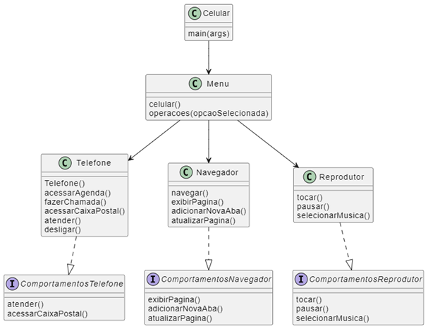

# LAB-03: Modelando o iPhone com UML: Funções de Músicas, Chamadas e Internet

Este é um simulador simples de celular em Java que permite interagir com recursos básicos como telefone, navegador de internet e reprodutor de música.

## Diagrama UML

## Estrutura do Código

O código é organizado em pacotes:

* **celular:** Contém a classe principal `Celular` que inicia o programa.
* **celular.Menu:** Contém a classe `Menu`, responsável por exibir os menus e gerenciar as opções escolhidas.
* **celular.Telefone:** Contém as classes relacionadas à funcionalidade do telefone.
* **celular.Navegador:** Contém as classes relacionadas à funcionalidade do navegador.
* **celular.ReprodutorMusical:** Contém as classes relacionadas ao reprodutor de música.

## Funcionalidades

* **Telefone:**
  * Fazer chamadas para contatos pré-definidos ou adicionados.
  * Acessar e editar a agenda de contatos.
  * Verificar a caixa postal (atualmente sem mensagens).
* **Navegador:**
  * Simula a navegação em páginas da web (requer digitar o endereço).
  * Abre novas abas automaticamente.
* **Reprodutor de Música:**
  * Reproduz uma lista de músicas pré-definidas.
  * Permite pausar e retomar a reprodução.

## Como usar

1. **Compilação:** Compile os arquivos Java usando o comando `javac *.java` no diretório onde os arquivos estão localizados.
2. **Execução:** Execute o simulador com o comando `java celular.Celular`.
3. **Menu Principal:** Você será apresentado ao menu principal, onde pode escolher entre Telefone, Internet, Música ou Desligar.
4. **Interação:** Siga as instruções em cada funcionalidade para interagir com o simulador.

## Considerações

* O simulador é bastante básico e não possui interface gráfica. A interação ocorre via terminal.
* A funcionalidade de internet é uma simulação e não acessa páginas da web reais.
* A caixa postal não armazena mensagens de fato.
* A interface `Runnable` é implementada em algumas classes, mas o método `run` não é utilizado neste código atual.

