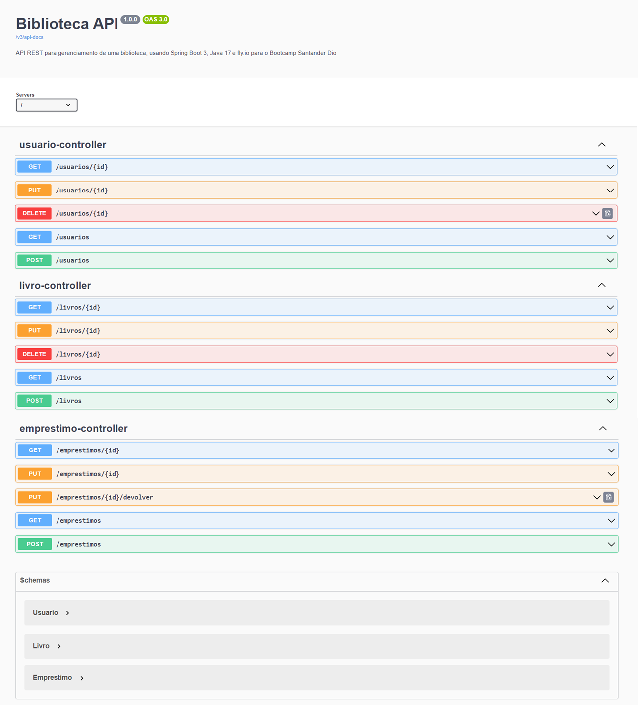
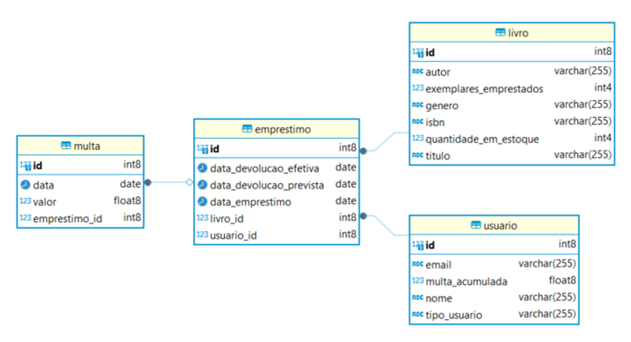

# LAB-07: API REST na Nuvem Usando Spring Boot 3, Java 17 e Fly.io

## Sistema de Gerenciamento de Biblioteca



Este projeto Java implementa uma API REST para gerenciar uma biblioteca, permitindo o cadastro e busca de livros, gerenciamento de usuários, registro de empréstimos e devoluções, além de integração com catálogos online e geração de relatórios. O sistema utiliza o Spring Boot 3 para agilizar o desenvolvimento e implementa boas práticas para garantir uma arquitetura robusta e escalável, além de ser implantado na nuvem com o Fly.io.

## Tecnologias Utilizadas

* **Java 17:** Linguagem de programação principal, com recursos modernos e aprimorados.
* **Spring Boot 3:** Framework para desenvolvimento rápido de aplicações web Java, com recursos avançados e suporte para Java 17.
* **Spring Data JPA:** Simplifica o acesso a dados com JPA (Java Persistence API), facilitando a interação com o banco de dados.
* **PostgreSQL:** Banco de dados relacional robusto e escalável para armazenar os dados da biblioteca.
* **Fly.io:** Plataforma de hospedagem de aplicações em nuvem, com foco em escalabilidade e facilidade de uso. Escolhido por manter a opção freeware para desenvolvedores hobby, ao contrário do Railway App que removeu essa opção.
* **Lombok:** Reduz a verbosidade do código com anotações para geração automática de getters, setters, etc. (opcional).
* **Spring Security:** Framework para autenticação e autorização, protegendo os endpoints da API.
* **Validation:** Fornece recursos para validação de dados, garantindo a integridade das informações.
* **Springdoc OpenAPI (Swagger):** Gera documentação interativa da API REST, facilitando o entendimento e o uso.


## Modelagem do Banco de Dados de Biblioteca

A imagem apresenta um modelo de banco de dados relacional para um sistema de gerenciamento de biblioteca. A seguir, descrevo a modelagem do banco, incluindo as tabelas, seus atributos e os relacionamentos entre elas:

**Tabelas:**

* **Livro:**
  * id (int8): Identificador único do livro (Chave Primária).
  * autor (varchar(255)): Nome do autor do livro.
  * exemplares_emprestados (int4): Quantidade de exemplares do livro emprestados no momento.
  * genero (varchar(255)): Gênero literário do livro.
  * isbn (varchar(255)): Número ISBN do livro.
  * quantidade_em_estoque (int4): Quantidade de exemplares do livro disponíveis no estoque.
  * titulo (varchar(255)): Título do livro.
* **Emprestimo:**
  * id (int8): Identificador único do empréstimo (Chave Primária).
  * data_devolucao_efetiva (date): Data em que o livro foi devolvido (pode ser NULL se ainda não devolvido).
  * data_devolucao_prevista (date): Data prevista para a devolução do livro.
  * data_emprestimo (date): Data em que o livro foi emprestado.
  * livro_id (int8): Identificador do livro emprestado (Chave Estrangeira referenciando Livro.id).
  * usuario_id (int8): Identificador do usuário que pegou o livro emprestado (Chave Estrangeira referenciando Usuario.id).
* **Multa:**
  * id (int8): Identificador único da multa (Chave Primária).
  * data (date): Data em que a multa foi gerada.
  * valor (float8): Valor da multa.
  * emprestimo_id (int8): Identificador do empréstimo ao qual a multa está relacionada (Chave Estrangeira referenciando Emprestimo.id).
* **Usuario:**
  * id (int8): Identificador único do usuário (Chave Primária).
  * email (varchar(255)): Endereço de e-mail do usuário.
  * multa_acumulada (float8): Valor total das multas acumuladas pelo usuário.
  * nome (varchar(255)): Nome do usuário.
  * tipo_usuario (varchar(255)): Tipo de usuário (ex: aluno, professor, funcionário).

**Relacionamentos:**

* **Livro - Emprestimo:** Um livro pode ser emprestado várias vezes (1:N).
* **Usuario - Emprestimo:** Um usuário pode realizar vários empréstimos (1:N).
* **Emprestimo - Multa:** Um empréstimo pode gerar uma multa (1:1).

**Diagrama Entidade-Relacionamento (DER):**



## Funcionalidades Principais

* **Gerenciamento de Livros:**
  * Cadastro, edição e exclusão de livros (título, autor, ISBN, gênero, etc.).
  * Busca por livros (por título, autor, ISBN, etc.).
  * Controle de estoque (quantidade disponível, exemplares emprestados).
* **Gerenciamento de Usuários:**
  * Cadastro, edição e exclusão de usuários (nome, e-mail, tipo de usuário: comum, funcionário, admin).
* **Gerenciamento de Empréstimos:**
  * Registro de empréstimos (usuário, livro, data de empréstimo, data de devolução prevista).
  * Controle de devoluções (registro de devolução, cálculo de multas).
* **Integração com Catálogo Online:** (Funcionalidade a ser implementada)
  * Busca de informações de livros em catálogos online (Google Books API, etc.).
  * Importação automática de dados de livros.
* **Relatórios e Estatísticas:** (Funcionalidade a ser implementada)
  * Geração de relatórios de empréstimos, devoluções, livros mais populares, etc.

## Exemplo de Uso

**Bash**

```
# Buscar todos os livros:
curl -X GET "https://api-biblioteca-bootcamp.fly.dev/livros"

# Buscar um livro por ID:
curl -X GET "https://api-biblioteca-bootcamp.fly.dev/livros/1"

# Criar um novo livro:
curl -X POST "https://api-biblioteca-bootcamp.fly.dev/livros" \
     -H "Content-Type: application/json" \
     -d '{
           "titulo": "Novo Livro",
           "autor": "Autor do Livro",
           "isbn": "9781234567890",
           "genero": "Ficção",
           "quantidadeEmEstoque": 10,
           "exemplaresEmprestados": 0
         }'
```


Para mais detalhes e exemplos, consulte a documentação da API no Swagger UI:

```
https://api-biblioteca-bootcamp.fly.dev/swagger-ui/index.html
```

## Como Executar o Projeto

1. Clone o repositório.
2. Configure as credenciais do banco de dados no arquivo `application.properties`.
3. Execute o comando `mvn clean package` para construir o projeto.
4. **Para rodar localmente:** Execute o comando `java -jar target/biblioteca-0.0.1-SNAPSHOT.jar` para iniciar a aplicação.
5. **Para deploy na nuvem:**
   * **Se você já tiver uma conta no Fly.io:** Execute `flyctl deploy`.
   * **Se você não tiver uma conta no Fly.io:**
     1. Execute `flyctl auth signup` para criar uma conta.
     2. Execute `flyctl launch` para configurar seu aplicativo.
     3. Execute `flyctl deploy`.
6. Acesse o Swagger UI para testar a API.
